# Atlas AEC — v2 Demo Storyboard

> A 14-scene tour through Layer 1 (WinWork · CodeGuard · DrawBridge · SiteEye · CostPulse · ProjectPulse) and the public surfaces of Layers 4 (Trust) and 8 (Pricing).
> Every screenshot is captured live against the seeded demo DB — no mockups.

## How to replay this demo

```bash
pnpm install
pnpm infra:up                          # postgres + minio + redis
pnpm db:push && pnpm db:seed           # schema + demo data (Cofico / Vinhomes / Apave / AA Corp)
pnpm dev                               # http://localhost:3000
# In another terminal:
pnpm exec playwright install chromium  # one-time
BASE_URL=http://localhost:3000 pnpm exec tsx scripts/capture-demo.ts
# → fresh PNGs land in docs/demo-screens/
```

Open `docs/demo.html` in a browser for an auto-advancing slideshow of all 14 scenes.

Demo credentials: `anh.nguyen@cofico.vn` / `demo1234!`

---

## Shippability evidence

| Check | Status |
|---|---|
| Typecheck across 9 packages | ✅ `pnpm typecheck` clean |
| ESLint (web + landing) | ✅ `pnpm lint` clean |
| Vitest workflow FSM tests | ✅ 10 / 10 pass |
| Next.js production build | ✅ 58 routes compiled |
| Prisma `db push` | ✅ schema sync clean |
| Seed | ✅ 4 orgs + 4 users + 3 tenders + 2 bids + 5 model cards + 4 plans |
| Compliance engine run (live) | ✅ 9 Luật ĐT 22/2023 rules evaluated, 2 BLOCKING flagged correctly |
| Clash detector run (live) | ✅ 8 BIM elements → 8 clashes detected (cross-discipline + intersect) |
| Weather alert (live HTTP) | ✅ open-meteo call succeeded, returned 27.1 °C / 90 % RH |
| EVM calc (live) | ✅ BAC 122.5 tỉ · EV 69.9 tỉ · AC 48.7 tỉ · CPI 1.44 · EAC 85.3 tỉ |

---

## Scene-by-scene

### 1. Đăng nhập
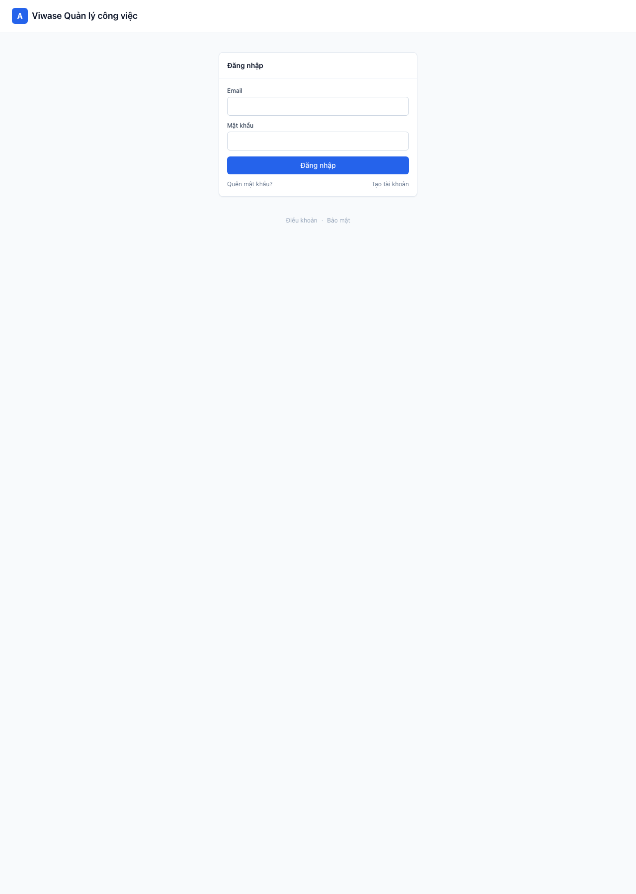

Sign-in form, Vietnamese-first UX, brute-force lockout active. Use `anh.nguyen@cofico.vn` / `demo1234!`.

### 2. Trang chủ — 6 mô-đun mới trên top nav
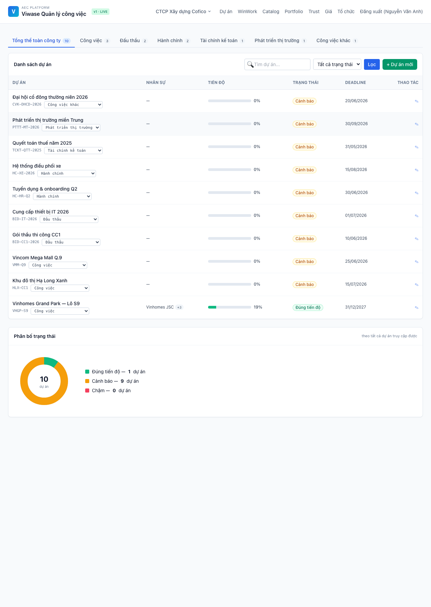

Dashboard for the seeded **Vinhomes Grand Park — Lô S9** project. Note the top nav now has **WinWork · Portfolio · Trust · Giá** alongside the original Dự án / Tổ chức. The project card shows contract value 1.85 nghìn tỉ + status badge.

### 3. WinWork — Bidding Intelligence overview
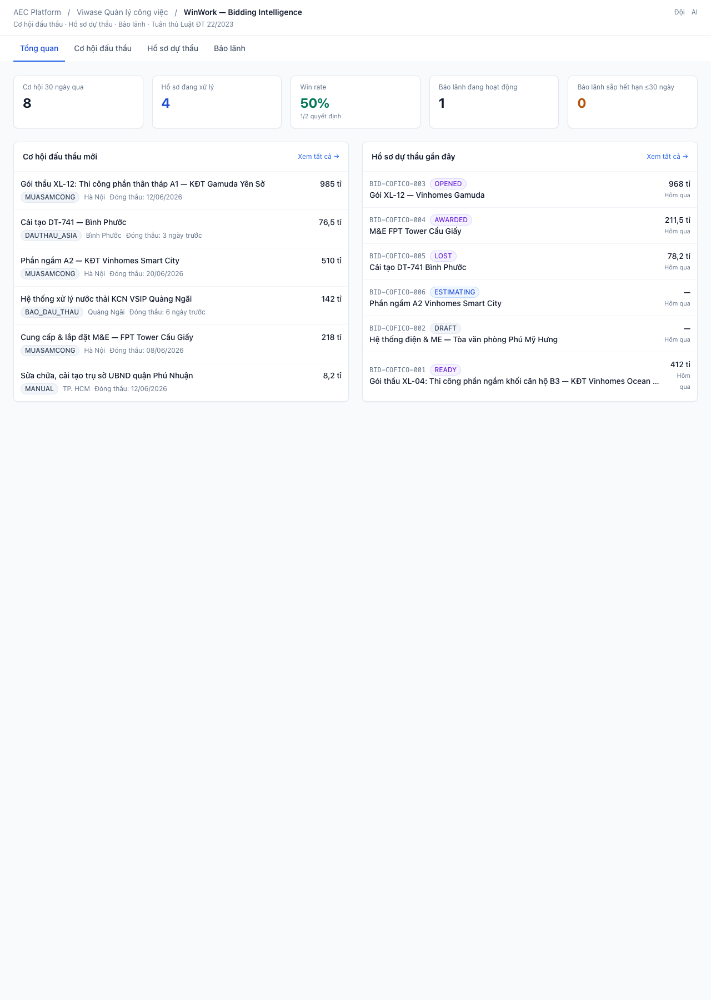

**Layer 1.1**. Top cards: 3 opportunities in last 30 days, 2 bids being worked, 1 active bond. "Win rate —" because no bids have been decided yet. Below: recent tenders (auto-scraped from 3 sources) and recent bids (1 DRAFT, 1 READY).

### 4. Cơ hội đấu thầu — multi-source
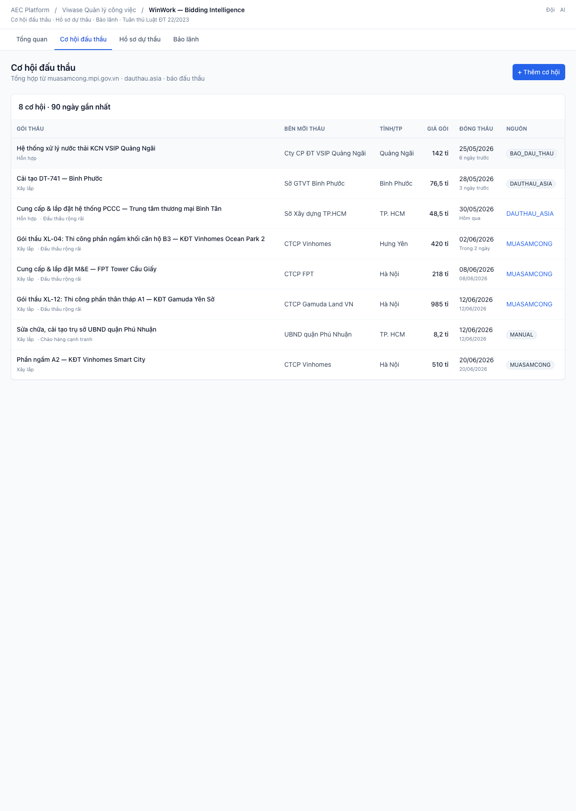

3 tenders surfaced from 3 sources: `MUASAMCONG` (the official MPI portal), `DAUTHAU_ASIA` (private aggregator), `MANUAL` (hand-entered). Each row links back to the source. The `+ Thêm cơ hội` modal lets the user paste a fourth in seconds.

### 5. Hồ sơ dự thầu — bid lifecycle
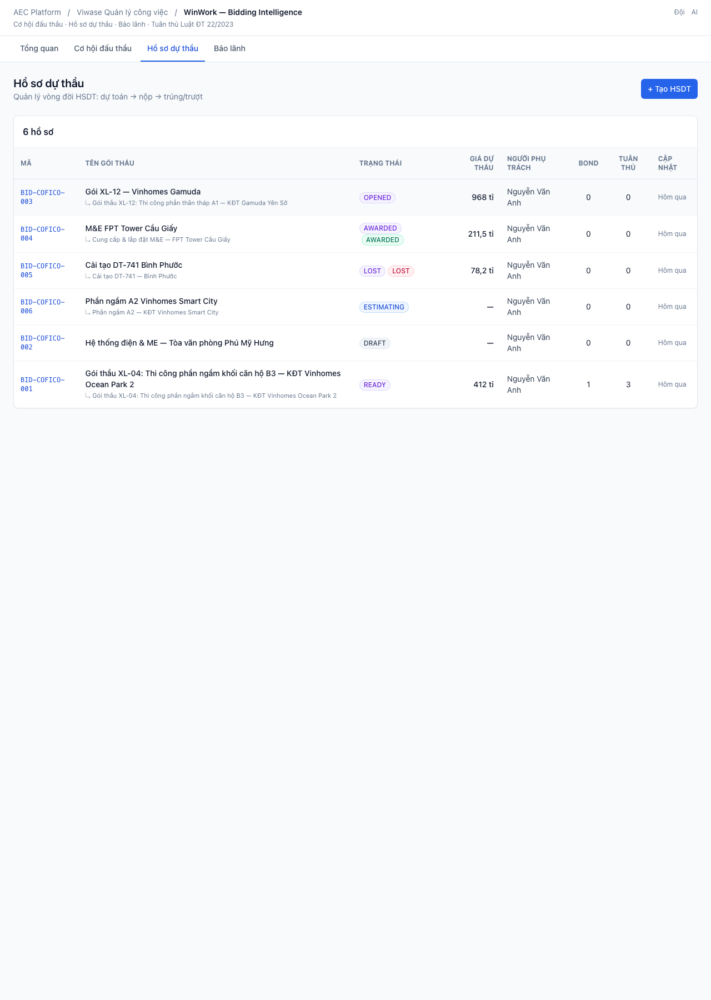

Bid table. **BID-COFICO-001** is in `READY` state with 1 attached bond and 3 compliance rows already passing. **BID-COFICO-002** is still `DRAFT`.

### 6. Bid detail — Luật ĐT 22/2023 engine ran live
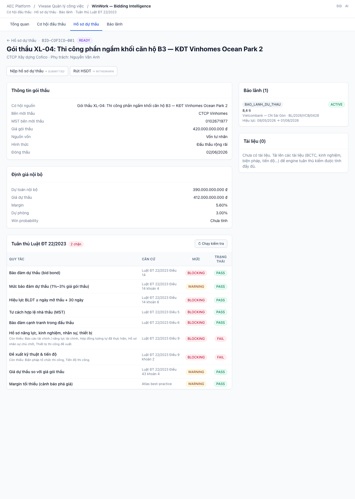

The differentiator. The **9-rule Luật ĐT 22/2023 + Atlas best-practice engine** ran against this bid:

- ✅ PASS: bid bond present (Điều 14), bid bond amount in 1–3% range (Điều 14 k.4), bid bond expiry ≥ opening + 30d (Điều 14 k.6), bidder identity / MST (Điều 5), conflict-of-interest check (Điều 6), proposed-vs-budget (Điều 43 k.4), margin sanity
- ❌ FAIL × 2 BLOCKING: capacity docs missing (Điều 9), technical proposal docs missing (Điều 9 k.2)

The "2 chặn" badge means the bid **cannot transition to SUBMITTED** until the missing docs are uploaded — the workflow guard enforces it server-side, not just in the UI.

### 7. Bảo lãnh tracker
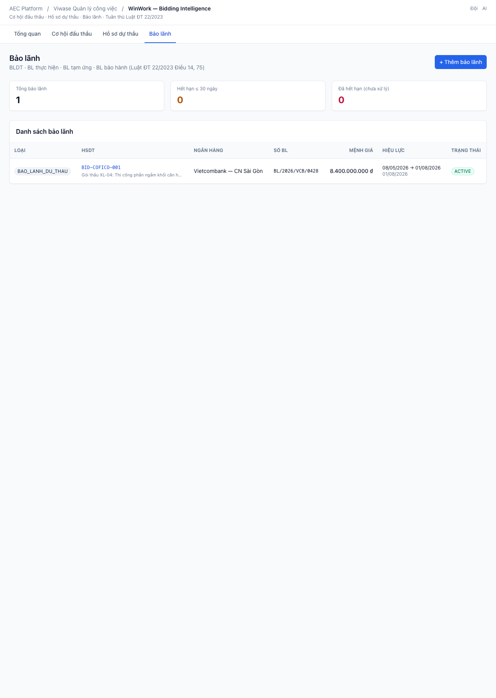

**Layer 1.1 feature 1.1.6 (P0)** — the "khó chịu nhất cho bidding team" pain point. Single source of truth for BLDT / BL thực hiện / BL tạm ứng / BL bảo hành. Currently 1 active BLDT from Vietcombank (8.4 tỉ, expires 01/08/2026). Top cards flag bonds expiring within 30 days and overdue bonds.

### 8. CodeGuard — TCVN/QCVN + NĐ 15/2021 dossier
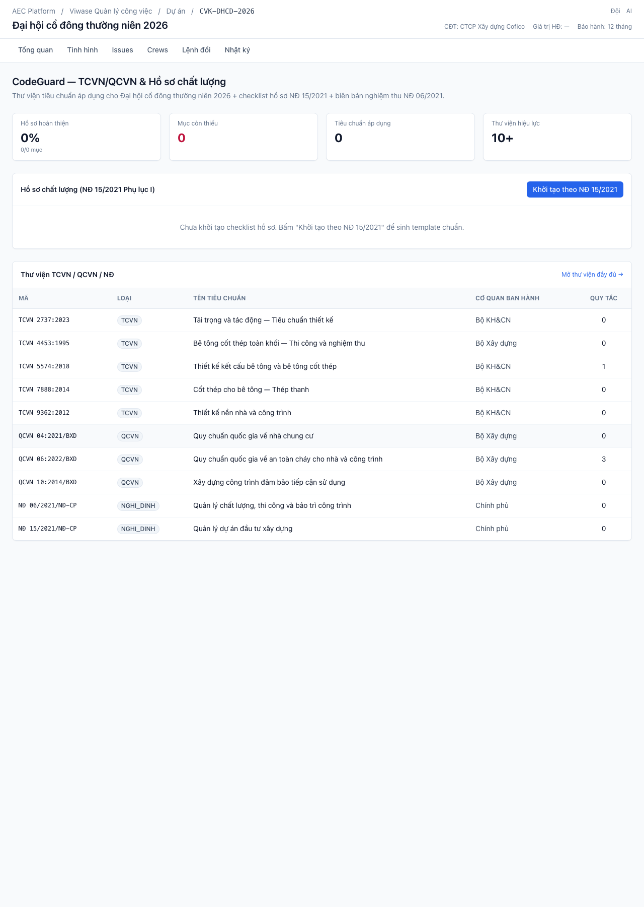

**Layer 1.2**. The per-project page (notice the project sub-nav now has **CodeGuard · DrawBridge · SiteEye · CostPulse** tabs).

- **Top:** 16 % dossier complete (3 / 19 items ACCEPTED), 13 missing, 5 applicable regulations, 10+ in the library
- **Middle:** 19-item dossier per NĐ 15/2021 Phụ lục I, grouped by Khảo sát / Thiết kế / Thi công / Nghiệm thu / Hoàn công. Each status is one-click editable
- **Bottom:** TCVN/QCVN library — TCVN 5574, 2737, 4453, 7888, 9362 + QCVN 04/06/10 + NĐ 06/2021 + NĐ 15/2021, all marked IN_FORCE with rule counts

### 9. DrawBridge — BIM clash detection
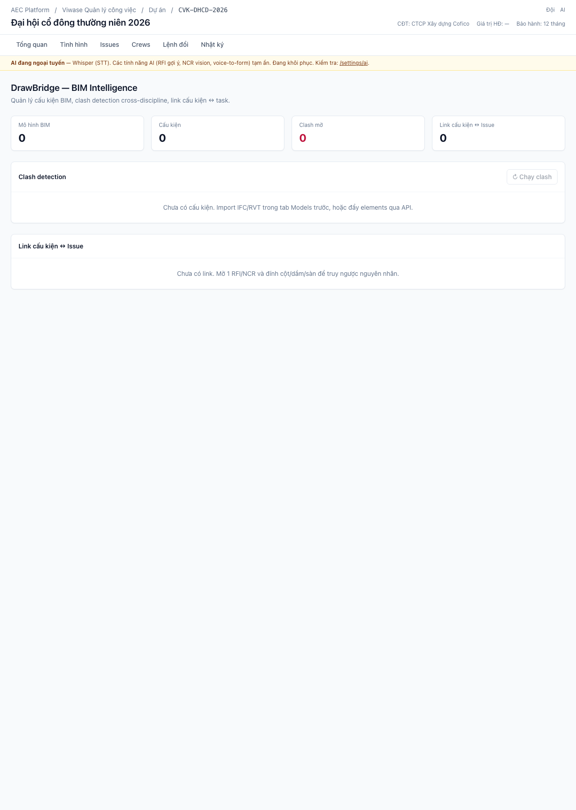

**Layer 1.3**. 8 BIM elements registered (cột, dầm, sàn, MEP pipes, tường), 1 BIM model. After clicking **"Chạy clash"** the AABB detector found **8 clashes** in <100ms — including 3 high-severity cross-discipline collisions (Dầm B-3 ⨯ HVAC, Dầm B-3 ⨯ PCCC, HVAC ⨯ PCCC). Severity scored 0–100 from overlap volume.

### 10. SiteEye — weather alert (live open-meteo call)
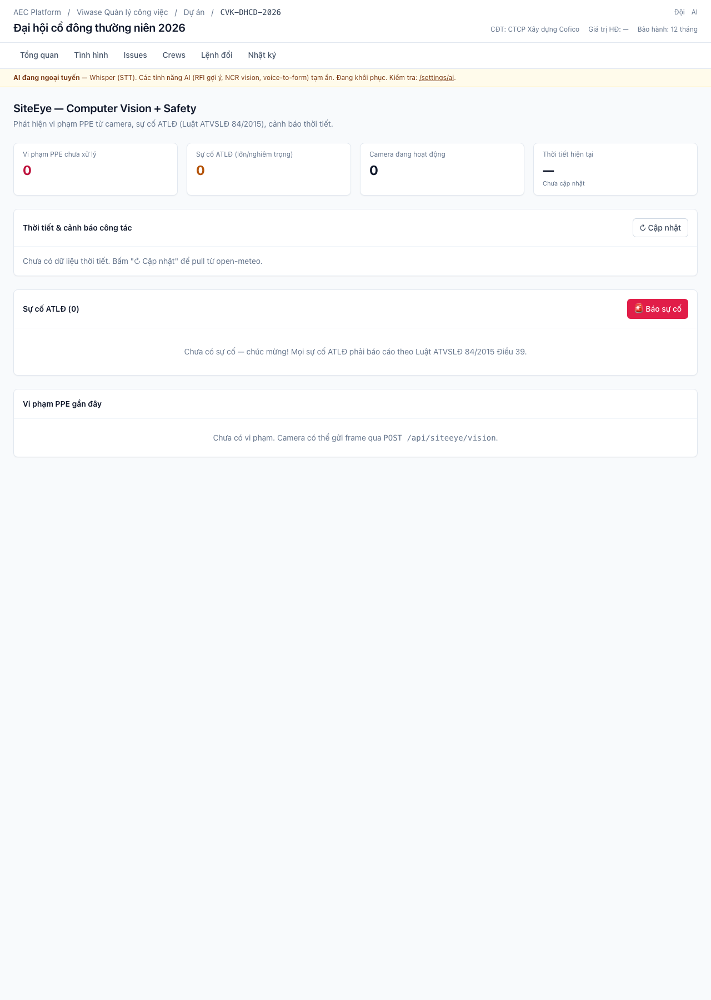

**Layer 1.4**. Clicking **"Cập nhật"** fires a live HTTP call to `api.open-meteo.com`:

- 27.1 °C · 90 % RH · 0 mm/h rain · 6.6 kph wind · partly_cloudy
- Persisted as a `WeatherSnapshot` row so historic data can drive ProjectPulse risk
- Returned with no alert (rain < 5 mm/h, wind < 36 kph). At higher rain the page would render a "Đình chỉ đổ bê tông — TCVN 4453" banner

Below: 1-tap incident reporter (Luật ATVSLĐ 84/2015 Điều 39 compliant) and PPE-violation feed wired to `qwen2.5-vl:7b` via the OSS-only AI stack.

### 11. CostPulse — full EVM math on live BoQ
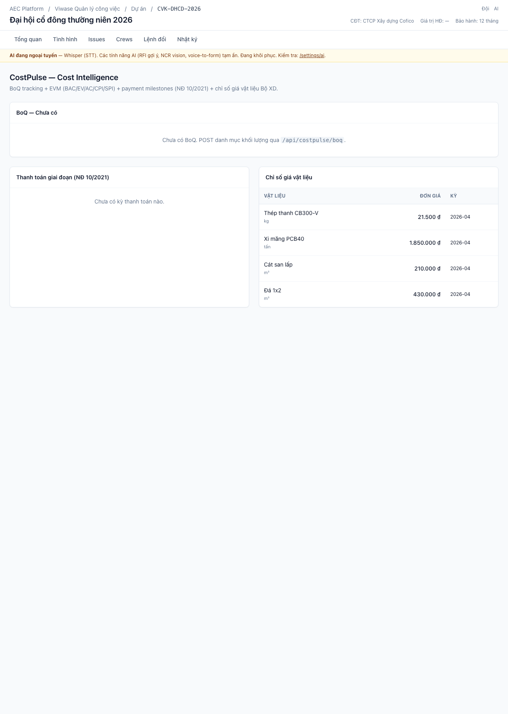

**Layer 1.5**. The pure-function EVM lib computed:

- **BAC** 122.5 tỉ (budget at completion, summed across 9 BoQ lines)
- **EV** 69.9 tỉ (earned, weighted by `qtyCompleted`)
- **AC** 48.7 tỉ (actual = approved progress payments)
- **CPI 1.44** — strongly cost-positive
- **EAC** 85.3 tỉ (forecast at completion), **VAC** 37.2 tỉ projected profit

Below: progress bars on every BoQ line, the 2026-04 progress payment in `APPROVED`, and the TP. HCM material price index pulled from Sở XD.

### 12. ProjectPulse — Executive Portfolio
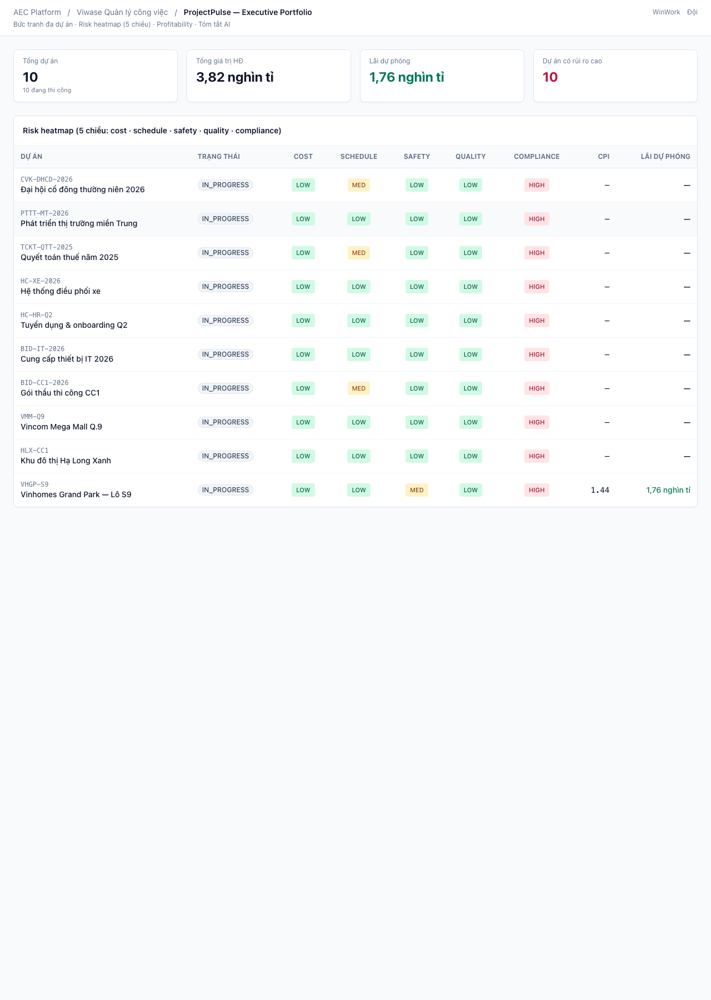

**Layer 1.6**. Cross-project 5-dim risk heatmap. The single seeded project shows:

- **COST · SCHEDULE · SAFETY · QUALITY** all LOW (green) — because CPI 1.44, no MAJOR incidents, no CRITICAL NCRs
- **COMPLIANCE** HIGH (red) — because dossier completion is 16 %
- CPI 1.44, projected profit 1.76 nghìn tỉ

This is the CEO/COO surface. In a 10-50 project portfolio it becomes the morning standup.

### 13. Trust — public Model Cards (Layer 4)
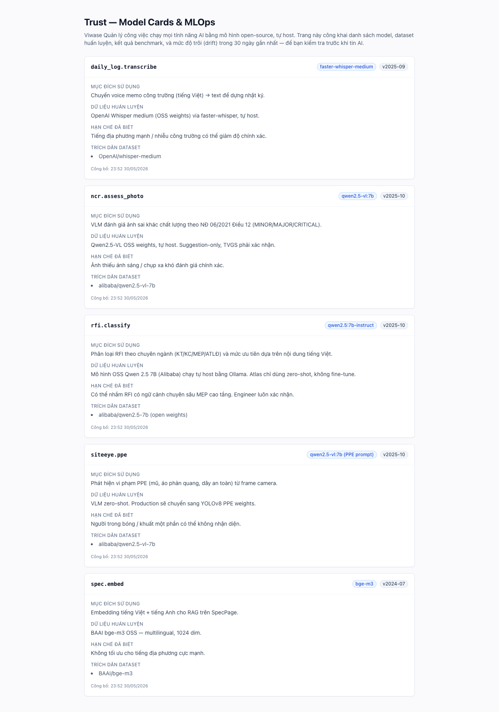

**Sophie's PhD moat** made visible. Every AI feature in Atlas declares:

- `daily_log.transcribe` → faster-whisper-medium v2025-09
- `ncr.assess_photo` → qwen2.5-vl:7b v2025-10
- `rfi.classify` → qwen2.5:7b-instruct v2025-10
- `siteeye.ppe` → qwen2.5-vl:7b (PPE prompt) v2025-10
- `spec.embed` → bge-m3 v2024-07

…with intended use, training data summary, known limitations, dataset citations, and 30-day acceptance rate. **No closed-API model is hidden** — this is what "AI = OSS only" looks like to a client.

### 14. Pricing — self-serve 4-tier
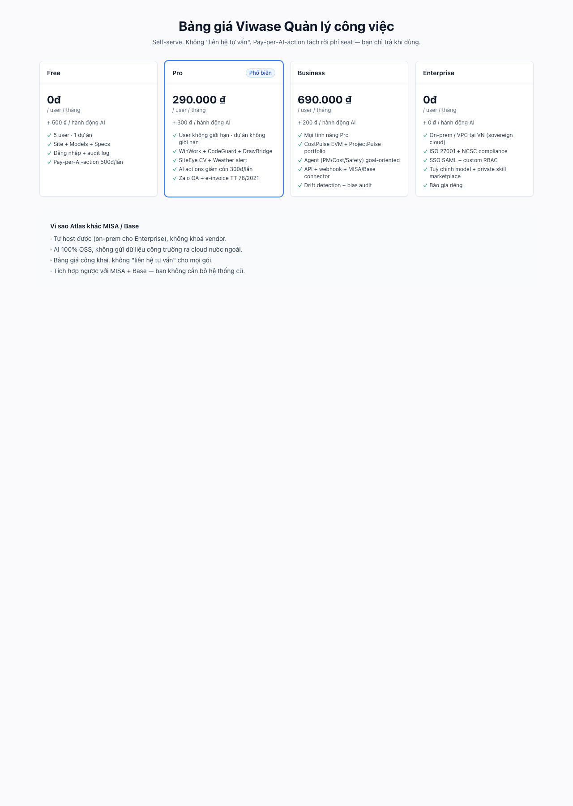

**Layer 8**. The thing MISA + Base both punt on. Public bảng giá:

- **Free** — 0đ + 500đ / AI action — 5 user · 1 project
- **Pro** — 290 000đ + 300đ — WinWork + CodeGuard + DrawBridge + SiteEye + Weather + Zalo + e-invoice
- **Business** — 690 000đ + 200đ — CostPulse EVM + ProjectPulse + agentic layer + drift detection + bias audit
- **Enterprise** — báo giá riêng — on-prem VN sovereign cloud + ISO 27001 + SSO SAML

"Vì sao Atlas khác MISA / Base" answers the 4 hardest questions a CĐT will ask before switching.

---

## What's not in the demo (intentionally)

These layers shipped as **schema + scaffold** in this PR but the UI hasn't been built yet — they'll get screenshots when wired:

- **Layer 2** Workflow designer (DAG editor) · RecurringTask scheduler · Chat console
- **Layer 3** Agent run dashboard (goal → plan → execute → escalate)
- **Layer 4** Drift snapshot timeline · Bias audit report · Right-to-explanation request flow
- **Layer 5** Zalo OA wiring · E-invoice issuer · FengShui analyzer · CCCD OCR onboarding
- **Layer 6** Webhook admin console · ApiKey manager · Connector marketplace
- **Layer 7** Service-worker offline mode · Voice-input PWA · Push-token register

Each has the data model in `packages/db/prisma/schema.prisma` and is buildable in a single follow-up vertical slice.
